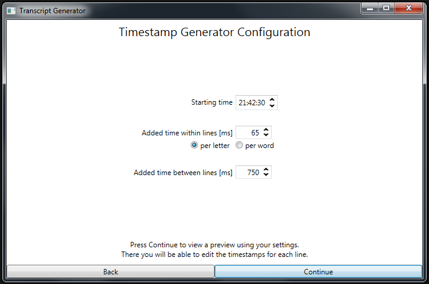

# 📜 TranscriptGenerator
Configurable tool for generating a transcript with timestamps from plain text

## 💡 [Example](docs/example.md)

## ⚡ Deployment

### 📋 Prerequisites

* [Microsoft .NET Framework 4.5](https://www.microsoft.com/en-us/download/details.aspx?id=30653)

### 🚀 Getting Started

Just copy over `TranscriptGenerator.exe` and run it. An installation is not needed.

## 🛠️ Development

These instructions will get you a copy of the project up and running on your local machine for development and testing purposes. See deployment for notes on how to deploy the project on a live system.

### 📋 Prerequisites

* [Visual Studio 2015/2017](https://www.visualstudio.com/de/vs/) - Fully-featured IDE for Android, iOS, Windows, web, & cloud

## 🔧 Built With

* [Extended WPF Toolkit](https://github.com/xceedsoftware/wpftoolkit) - All the controls missing in WPF
* [Costura](https://github.com/Fody/Costura) - Embeds dependencies as resources

## 👨‍💻 Authors

* **Robin Hartmann** - [robin-hartmann](https://github.com/robin-hartmann)

## 📃 License

This project is licensed under the MIT License - see the [LICENSE](LICENSE) file for details
